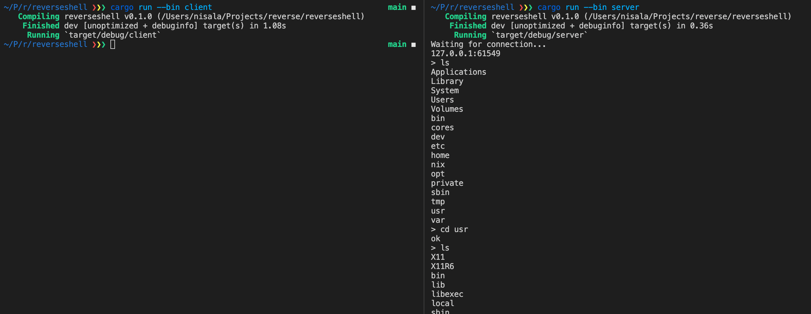

# TCP Reverse Shell

## Introduction

As an attacker, getting shell access to a victim's machine is incredibly powerful, and gives the attacker the power to do virtually anything to the machine. Typically, shell access to a machine is established by someone else from the outside requesting a shell session to it. This is called a **bind shell**. However, oftentimes, the machine isn't publically accessible -- it might be behind a firewall, or behind a NAT (and thus doesn't have a public IP address). In this case, in order to get a shell session, the victim's machine itself has to create it, connect *back* to the attacker's machine, and pipe the session to it. Because this shell is created in reverse to how shell sessions are usually established (victim to attacker instead of attacker to victim), it's called a **reverse shell**.

## Basic Setup

This reverse shell program is written in Rust. It's unique in that instead of establishing a shell session and directly sending it to the attacker with a tool like `nc` or `telnet`, or even just establishing a shell session and sending its output to a socket, it doesn't establish a long-lasting shell session at all. Instead, commands are executed separately, as they come in, and the current working directory is persisted within the program instead of within the shell. This was done because using `nc` and the like is quite common, and is thus often [easy to detect](https://sysdig.com/blog/reverse-shell-falco-sysdig-secure/). The article linked above talks about several things sysadmins might look for to detect reverse shells:

- `nc` with remote code execution -- will not catch this program. `nc` or similar is not used.
- Redirect stdout/in to network -- will not catch this program. Each command's output is piped to a buffer within the binary, and *then* sent through the TCP socket.
- `dup` stdout/in for network -- once again, not done here. 
- Long-lasting shell sessions (with tools like `ps`) -- will not catch this program, since commands are executed separately without a long-lasting shell.
- Repeated network connections to stange IP/domain -- can be circumvented with DGA, as will be shown later.

Commands and their outputs are sent between the server (attacker, `src/server.rs`) and client (victim, `src/client.rs`) using a TCP connection. As is standard, a password is used at the start of the connection to ensure that the attacker is the one binding to the TCP socket and not someone else. This is especially important when using DGA, where the attacker may not always control the domain the client is connecting back to. The client also runs the `fork` syscall at the start of the program so the program looks like it immediately exits. 

In order to launch the server, run `cargo run --bin server`, which will open a port for incoming connections.

In order to demo the exploit, you can run `cargo run --bin client` on the same machine as the server. A shell will open right away on the server. Run `exit` on the server to close the connection (the server will automatically start waiting for the next client connection after this command).

This, however, just uses a hardcoded IP. We can do a lot better.

## Finding the IP to Connect To

The code for all of the following methods can be seen in `src/ipaddr.rs`.

### Method 1: Hardcoding

`cargo run --bin client hardcoded`

As we showed above, hardcoding an IP for the client to connect back to is all good and well, but it's far easier to catch. Additionally, if the IP gets blocked by the victim's firewall, the attacker now has no way of getting the client to connect back to somewhere else to continue the attack. In order to solve this, we can try the next method.

### Method 2: Get the IP from Somewhere Else

`cargo run --bin client pastebin`

In this method, there's still something hardcoded -- but this time, it's a link to a Pastebin, which contains the IP the client should connect back to. This means that the attacker can change the IP the client connects back to any time they want, in order to circumvent basic reactionary firewall rules the victim might set up to try to stop an attack. Pastebin is a very commonly used service, so requests to it shouldn't garner any suspicion, and aren't easily blocked. You can test this attack out yourself as well -- the currently hardcoded Pastebin will work if the client and server are running on the same machine. 

However, this Pastebin link is still hardcoded, and Pastebin could take it down at any time if they realize it's being used for malicious purposes. In order to solve this and make our connect-back URL dynamic but not reliant on any hardcoding, we can try the next method.

### Method 3: Basic DGA (Domain Generation Algorithm)

`cargo run --bin client dga`

In this method, the IP the client connects back to comes from a domain, and that domain name is generated from the current date with what's essentially a rudimentary random number generator seeded with the date. Generated numbers are modulo'd into lowercase characters (ASCII), and 16 characters are generated and concatenated. Because the generator is seeded with the date, the generated domain is different every day -- and one day, the attacker just might be controlling the domain. As of the date of writing (May 3rd 2022), that domain would be `btbpurnkbqidxxcl.com` (which is currently available for purchase!).

However, domains like this are quite easily detected. DGA domains, especially ones that look like this, look quite different from your average domain, and they can quickly arouse suspicion in network filters. Machine learning has been applied to this problem, and DGA domains like this can now be detected with [F1 scores of over 99%](https://doi.org/10.48550/arXiv.1611.00791). Thus, we need a method that generates more "real"-looking domains.

### Method 4: DGA with Word Lists

`cargo run --bin client dga_dict`

In this method, the same random number generator seeded by the current date is used. However, it's now used to index a [diceware word list](https://www.eff.org/files/2016/09/08/eff_short_wordlist_1.txt) (created with `src/create_word_list.py`). Three randomly selected words from the word list are combined in order to create a domain name. As of the date of writing (May 3rd 2022), that domain would be `bustslabferry.com`, which seems like a very reasonable domain for someone to go to (and it's also currently available for purchase!). 

Machine learning has also been applied to detecting these types of DGA domains, but the technology is still being developed and it's [not nearly as good as the detection of Method 3 DGA Domains](https://ieeexplore.ieee.org/document/8622066).

## Reflection

I really enjoyed completing this project. I'm always looking for excuses to write interesting Rust code, especially when it comes to working within the safety it provides. I'm also actively trying to learn more networking concepts since I feel like it's such a black box in my CS knowledge, so I definitely got something out of this project in that regard. Finally, it's really cool (and a little scary) to know that algorithms like this are actively being used by real-world malware, and that we still can't perfectly mitigate even simple attacks like this.